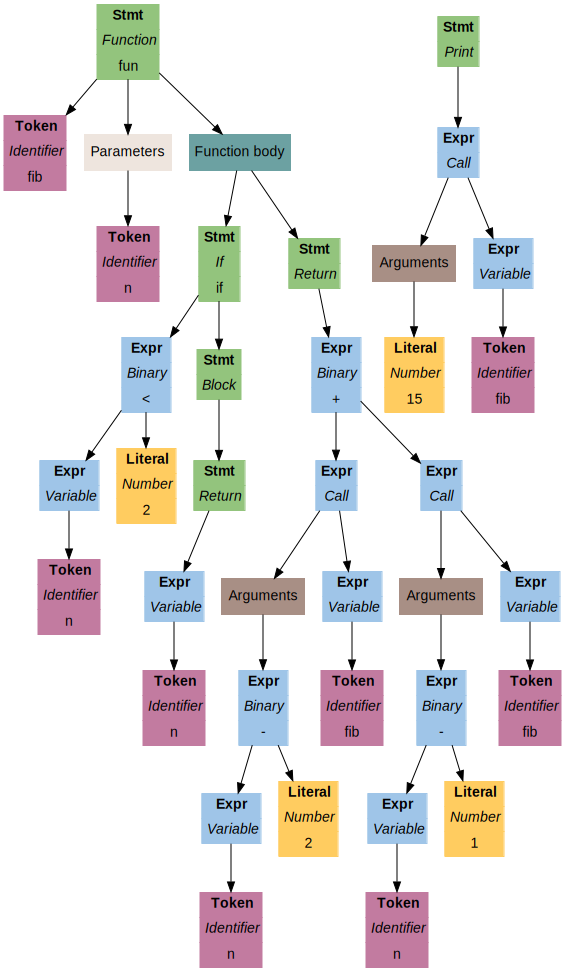

```
fun fib(n) {
    if (n < 2) {
        return n;
    }
    return fib(n - 2) + fib(n - 1);
}

print fib(15);
```

An Abstract Syntax Tree (AST) generated for the program above:



# What is it?

*Rust* implementations of *Lox* language as it is described in a
gorgeous book
[Crafting Interpreters](https://craftinginterpreters.com/).
I really recommend everyone to read it! Both fun and educational content.

# Why?

This is my first *Rust* project, my first project connected with interpreters/languages and
also my first project where I need to read *Java* code (I don't know the language) and port something from it.
So for me this project serves 2 main purposes:

- Learn *Rust* and get more comfortable with it
- Get some knowledge of how computer languages actually work internally

Also I learnt some *Java*. At least reading it.

# Structure

- `benchmark` — very simple benchmark for *Lox* implementations and comparison with some other languages
- `twi` — code for *Tree-Walk Interpreter*, as it is described in Part II of the [book](https://craftinginterpreters.com/),
   and also code for custom AST visualizer that outputs nice pictures such as the one above
- `bvm` — *Bytecode Virtual Machine*, as it is described in Part III of the [book](https://craftinginterpreters.com/)

`twi` and `bvm` are implemented as self-consistent and completely independent *Rust* crates.
`benchmark` is a set of independent scripts on various languages.

# Current status of the project

Unfinished. I plan to do more things. For example:

- Fix the way `twi` deals with environments, so the execution speed and some bugs will be fixed
- Finish `bvm` implementation, as it does not support OOP yet

I also have some ideas like adding new datatypes (arrays, hash maps) and other features.
