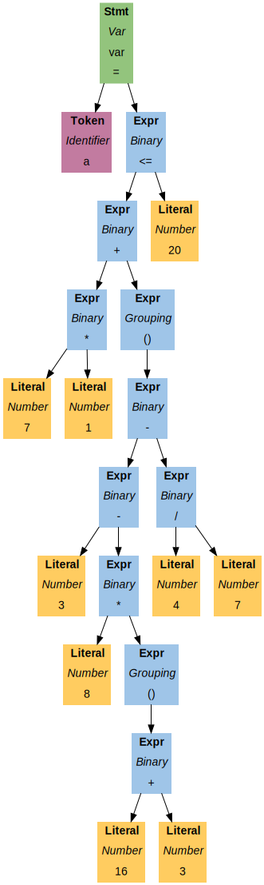

# What is it?

*Rust* implementation of *jlox* variant of *Lox* language as it is described in a
magnificent book
[Crafting Interpreters](https://craftinginterpreters.com/).

# Structure

- `/src` — code for tree-walk interpreter
- `/example` — simple example programs on *Lox* language
- `/example/debug` — programs with different edge cases on *Lox* that I used for testing (run tests via `run_example.sh`)
- `/gallery` — *.svg* pictures and corresponding *.gv* files that show ASTs for source code in `/example`
  (see [AST visualization](https://github.com/sevlabr/lox/tree/main/twi#ast-visualization) for details)

# Does it work?

For simple programs it does. But closures and sometimes classes may work really weird or even give an error for a valid code.
The reason for this is how I implemented environments. The original *Java* implementation stores a reference of an environment
for closure. When I was writing this part of interpreter I thought that it would be easier for me to use copies and update them.
It turned out to be wrong. I guess, usual approach would be the use of `Rc<RefCell<Environment>>`, so probably I will fix this problem
with environments if I have time. Overall, lexer, parser and resolver seem to work just fine, only the interpreter (which I call
*evaluator* in code) has some bugs.

# Examples

All basic and human-readable examples are in `/example` folder
(`debug` subfolder contains some tests for edge cases and thus the code here is probably quite hard to understand).
Currently, there are 4 examples: classes, closures, basic functions and control flow constructs. *.lox* files are the source code
and *.out* files contain outputs.

TODO: example of working class inside a block while failing outside.

# AST visualization

This crate supports 2 styles of AST visualization:
- standard `AstPrinter` as it is described in the original
  [book](https://craftinginterpreters.com/) and official
  [implementation](https://github.com/munificent/craftinginterpreters/blob/master/java/com/craftinginterpreters/lox/AstPrinter.java)
- `AstVis` that outputs AST in a [Graphviz](https://graphviz.org/) *DOT* language

I wrote the latter because `AstPrinter` is good only for very small programs. Consider this toy example:

```
var a = 7 * 1 + (3 - 8 * (16 + 3) - 4 / 7) <= 20;
```

`AstPrinter` prints:

```
(var a = (<= (+ (* 7 1) (group (- (- 3 (* 8 (group (+ 16 3)))) (/ 4 7)))) 20))
```

Using `AstVis` you can get this beautiful graph:



You can check for some more sophisticated examples in the `gallery` folder (they use code from `example` folder).

## Usage:
- For classic `AstPrint` just add `-p` option after the name of the file that contains source code. For example:
  ```
  cargo run -p twi -- /path/source.lox -p
  ```
- `AstVis` is invoked when `-v` option is used. For example:
  ```
  cargo run -p twi -- /path/source.lox -v
  ```
  This will output AST in *DOT* language. To get the picture you will need [Graphviz](https://graphviz.org/)
  installed or probably something else that can read this language.
  Using [Graphviz](https://graphviz.org/):
  ```
  dot -Tsvg /path/source.gv -o /path/source.svg
  ```
  Enjoy the view!
